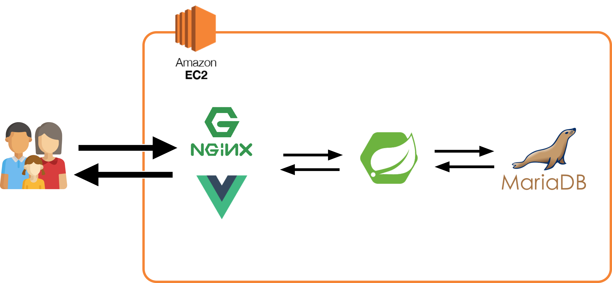
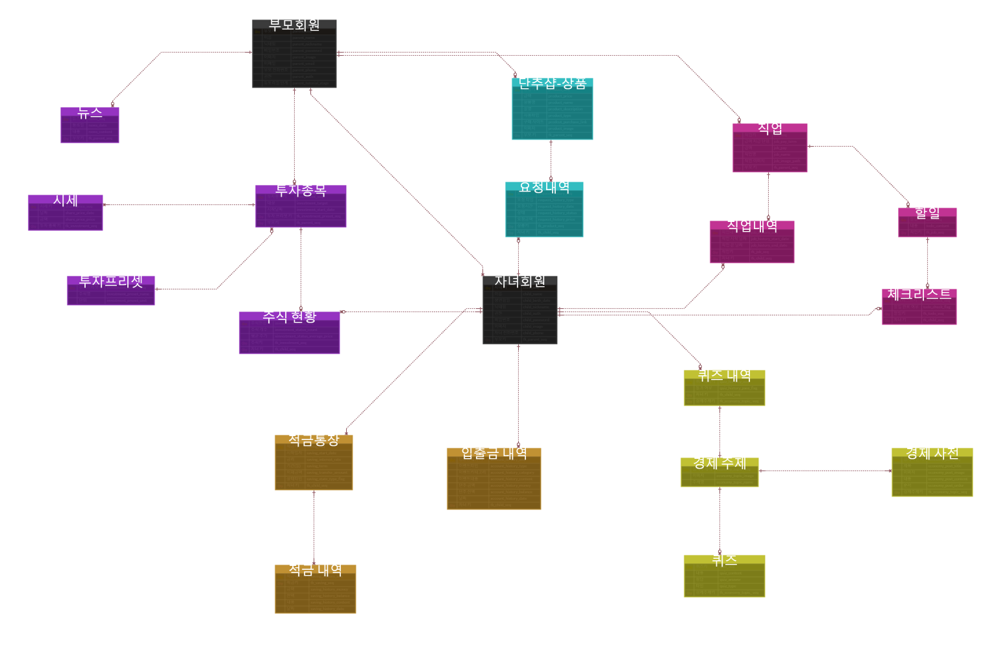

# 첫단추💰

## 👋 서비스 소개

> 우리 아이의 경제 교육 **첫 단추**를 꿰어줍니다.  
> 이론이 아닌 실제 활동으로 예/적금, 주식 등을 쉽고 재밌게 체험해 볼 수 있습니다.

## 📚 기술 스택

| Part         | Tech Stack                               |
| ------------ | ---------------------------------------- |
| **Frontend** | Vue.js, vue-router, vuex, axios, Vuetify |
| **Backend**  | Spring Boot, JPA, Spring Security, JWT   |
| **Database** | MariaDB                                  |
| **DevOps**   | AWS EC2, Nginx                           |

 

## ⚙️ 아키텍처

 

## 📂 ERD

 

## 담당 역할

<table width="100%">
  <tr>
    <td align="center">Frontend</td>
    <td>
      A. 공통 컴포넌트 개발  
      - Header, Bottom Nav, Modal 등 공통 컴포넌트 개발  
       
      B. 주요 페이지 및 기능 개발  
      - 랜딩페이지 개발  
      - 로그인, 회원가입 페이지 개발  
      - 아이 홈, 예금, 적금 페이지 개발  
      - 부모 튜토리얼, 부모 환전 요청, 내 정보 페이지 개발  
       
      C. 주요 모듈 개발  
      - API 호출 함수 개발  
      - Vuex 모듈 개발  
      - Navigation Guard를 사용한 Route 별 사용자 접근 권한 관리 기능 개발  
    </td>
  </tr>
  <tr>
    <td align="center">DevOps</td>
    <td>
      A. Nginx를 웹 서버 & 리버스 프록시로 사용해 배포  
    </td>
  </tr>
</table>
